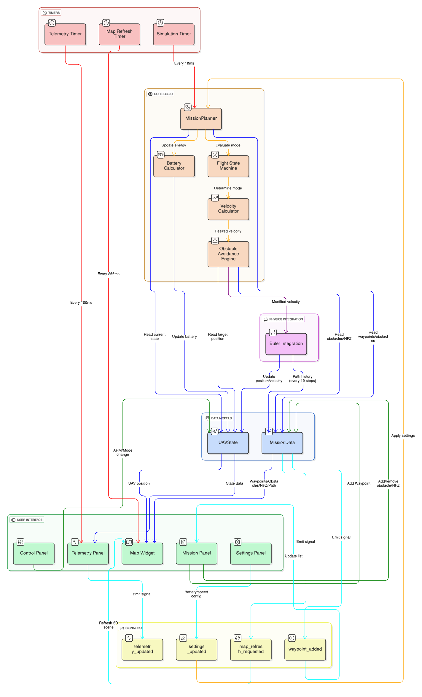

# VTOL Mission Control - Ground Control Station

A professional Ground Control Station (GCS) application for hybrid VTOL (Vertical Take-Off and Landing) UAV delivery missions, built with PyQt6 and real-time 3D visualization.



## 🚁 Features

### Core Capabilities
- **Autonomous Mission Planning**: Automated waypoint-based navigation from home to delivery point and back
- **VTOL Flight Modes**: Complete state machine for takeoff, cruise, landing, and emergency operations
- **Real-time 3D Visualization**: Interactive map showing UAV position, waypoints, obstacles, and flight path
- **Obstacle Avoidance**: Potential field-based collision avoidance with balanced repulsion/attraction forces
- **Altitude Hold**: Active P-controller maintains cruise altitude during horizontal flight
- **Boundary Constraints**: Prevents drone from exceeding map boundaries or going underground
- **Sequential Waypoint Navigation**: Follows custom waypoints in order with 50m proximity threshold
- **Emergency Operations**: Emergency Return-to-Launch (RTL) and Emergency Landing functionality

### Flight Control
- **ARM/DISARM**: Safety mechanism - drone must be armed before flight
- **START MISSION**: Automated mission execution
- **RETURN TO HOME**: Immediate return to launch point
- **EMERGENCY LAND**: Straight-down emergency descent at current position
- **Manual TAKEOFF/LAND**: Manual control buttons

### Mission Configuration
- **Battery Settings**: Configurable capacity (mAh) and voltage
- **Flight Performance**: Adjustable cruise speed, VTOL speed, max altitude, and cruise altitude
- **Drone Physical Properties**: Set drone weight and payload weight
- **Mission Points**: Define home position and delivery point coordinates
- **Custom Waypoints**: Click map to add waypoints, clear all with one button
- **Obstacles**: Add cylindrical obstacles with position and radius
- **No-Fly Zones (NFZ)**: Define restricted airspace areas

### Telemetry Display
- **Position**: Real-time X, Y, Z coordinates and distance from home
- **Velocity**: Ground speed, air speed, and vertical speed
- **Battery**: Percentage, remaining capacity, voltage, current, and time left
- **Flight Status**: Current mode, mission phase, armed status, GPS fix, and delivery status

## 📊 System Architecture

The application follows a modular architecture with clear separation of concerns:

### Data Flow Overview
1. **UI Timers** (10-100 Hz) trigger periodic updates
2. **Simulation Timer** (100 Hz) runs the mission planner
3. **MissionPlanner** evaluates flight mode and calculates desired velocity
4. **Obstacle Avoidance** applies repulsion/attraction forces
5. **Euler Integration** updates position and velocity
6. **UAVState** stores current drone state
7. **UI Panels** display telemetry and visualizations

### Key Components

#### Core Logic (`src/core/`)
- **`mission_planner.py`**: Main autonomous flight controller
  - Flight state machine (IDLE → VTOL_TAKEOFF → CRUISE → VTOL_LAND)
  - Waypoint navigation with sequential progression
  - Obstacle avoidance using potential fields
  - Velocity calculation for each flight mode
  - Altitude hold controller (P-controller with 0.5 gain)
  - Boundary constraint enforcement

- **`uav_state.py`**: Data structures for UAV state and mission configuration
  - Position, velocity, orientation tracking
  - Flight mode and mission phase enums
  - Battery state management
  - Waypoint index tracking

#### User Interface (`src/ui/`)
- **`main_window.py`**: Main application window
  - 3-panel layout: Telemetry (left), Map (center), Settings (right)
  - Signal/slot connections for real-time updates
  - Simulation loop with Euler integration
  - Ground constraint enforcement (altitude ≥ 0)

- **`control_panel.py`**: Flight control buttons (TAKEOFF, LAND)
- **`telemetry_panel.py`**: Real-time telemetry display with auto-refresh
- **`mission_panel.py`**: Mission configuration and obstacle/waypoint management
- **`settings_panel.py`**: Flight parameters and physical properties
- **`map_widget.py`**: 3D Matplotlib visualization with interactive features

## 🛠️ Installation

### Prerequisites
- Python 3.10 or higher
- Windows/Linux/macOS

### Setup
1. Clone the repository:
```bash
git clone https://github.com/I-am-Krish/Mission-Control-App-for-Hybrid-VTOL-Drones.git
cd Mission-Control-App-for-Hybrid-VTOL-Drones
```

2. Create a virtual environment:
```bash
python -m venv venv
```

3. Activate the virtual environment:
   - Windows: `venv\Scripts\activate`
   - Linux/macOS: `source venv/bin/activate`

4. Install dependencies:
```bash
pip install -r requirements.txt
```

### Required Packages
- **PyQt6** (6.7.0+): GUI framework
- **matplotlib** (3.8.0+): 3D visualization
- **numpy**: Numerical computations
- **dataclasses**: Data structure support

## 🚀 Usage

### Quick Start
**Windows:**
```bash
.\launch.bat
```

**Linux/macOS:**
```bash
./launch.sh
```

**Or manually:**
```bash
python demo.py
```

### Mission Workflow
1. **Configure Mission**:
   - Set home position (default: 0, 0, 0)
   - Set delivery point (e.g., 5000, 800, 120)
   - Add waypoints by clicking the map (optional)
   - Add obstacles/NFZ if needed (scrollable panel)

2. **Configure Flight Parameters**:
   - Adjust cruise speed (default: 50 m/s)
   - Set cruise altitude (default: 50 m)
   - Configure battery capacity

3. **Execute Mission**:
   - Click **DISARM** to arm the drone
   - Click **START MISSION** to begin autonomous flight
   - Watch the drone: VTOL Takeoff → Cruise → Land at delivery → Takeoff → Return home → Land → Idle

4. **Monitor Telemetry**:
   - Real-time position, velocity, and battery updates
   - 3D flight path visualization
   - Mode and phase indicators

### Emergency Controls
- **RETURN TO HOME**: Immediately flies back to launch point at cruise altitude
- **EMERGENCY LAND**: Descends straight down at 1.5x VTOL speed (no obstacle avoidance)

## 🎯 Flight Logic Details

### State Machine
```
IDLE → (ARM) → VTOL_TAKEOFF → (at altitude) → CRUISE → (at delivery) → VTOL_LAND
→ (landed, mark delivered) → VTOL_TAKEOFF → (at altitude) → CRUISE → (at home)
→ VTOL_LAND → (landed at home) → IDLE (DISARMED)
```

### VTOL Takeoff
- **Location**: [mission_planner.py](src/core/mission_planner.py#L168-L172)
- **Logic**: Vertical ascent at VTOL_SPEED (default: 10 m/s)
- **Transition**: When altitude within 5m of TAKEOFF_ALTITUDE

### VTOL Land
- **Location**: [mission_planner.py](src/core/mission_planner.py#L191-L209)
- **Logic**: Vertical descent at -VTOL_SPEED
- **Conditions**:
  - At delivery: Land → Mark delivered → Takeoff to return home
  - At home (delivered=True): Land → Disarm → Stay in IDLE
- **Ground Detection**: Altitude < 2.0m

### Cruise Mode
- **Location**: [mission_planner.py](src/core/mission_planner.py#L174-L189)
- **Logic**: 
  - Horizontal navigation toward target waypoint
  - Active altitude hold (P-controller)
  - Transitions to VTOL_LAND when within 20m of target

### Waypoint Navigation
- **Location**: [mission_planner.py](src/core/mission_planner.py#L64-L123)
- **Logic**:
  - Outbound: Follow waypoints sequentially, then delivery point
  - Return: Fly directly home
  - Advancement: 50m proximity threshold
  - Tracking: `current_waypoint_index` in UAVState

### Obstacle Avoidance
- **Location**: [mission_planner.py](src/core/mission_planner.py#L267-L377)
- **Algorithm**: Balanced potential field
  - **Obstacles**: 8x max repulsion, 250m influence radius
  - **NFZ**: 12x max repulsion, 300m influence radius
  - **Waypoint Attraction**: 2-8x based on distance (stronger when far)
  - **Vertical Forces**: Zeroed to maintain altitude
  - **Boundary Forces**: 5x push at map edges (X: 200-5800m, Y: 0-800m)

### Altitude Hold
- **Location**: [mission_planner.py](src/core/mission_planner.py#L250-L252)
- **Formula**: `vertical_correction = clip((CRUISE_ALTITUDE - current_altitude) * 0.5, -2.0, 2.0)`
- **Modes**: Active in CRUISE and EMERGENCY_RTL

### Ground Constraint
- **Location**: [main_window.py](src/ui/main_window.py#L357-L361)
- **Logic**: Clamps altitude to ≥ 0, prevents negative Z (underground)

## 📈 Recent Updates

### Latest Improvements (December 2025)
- ✅ Fixed landing loop issue - drone now properly disarms and stays in IDLE after mission completion
- ✅ Added ground constraint to prevent negative altitude (underground flight)
- ✅ Implemented sequential waypoint navigation system
- ✅ Enhanced obstacle avoidance with balanced forces
- ✅ Added active altitude hold in cruise modes
- ✅ Fixed emergency landing to descend straight down without obstacle avoidance
- ✅ Removed redundant UI elements (Target Altitude slider, Flight Mode toggle)
- ✅ Added boundary constraints to prevent drone from going off map
- ✅ Improved delivery detection requiring actual landing

### Performance Optimizations
- Reduced obstacle repulsion from 20x to 8x for smoother navigation
- Increased waypoint attraction from 2x to 2-8x based on distance
- Zeroed vertical forces in obstacle avoidance for stable altitude
- Map refresh rate: 5 Hz + signal-triggered updates
- Simulation rate: 100 Hz (Euler integration with dt=0.01s)

## 🧪 Testing

Run the test suite:
```bash
python -m pytest tests/
```

Test coverage includes:
- UAV state management
- Mission planner logic
- Obstacle avoidance calculations
- Flight mode transitions

## 📝 Configuration Files

- **`config/`**: Configuration templates (if needed)
- **`requirements.txt`**: Full Python dependencies
- **`requirements-minimal.txt`**: Minimal dependencies for production
- **`launch.bat`**: Windows launcher script
- **`launch.sh`**: Linux/macOS launcher script

## 🤝 Contributing

Contributions are welcome! Please:
1. Fork the repository
2. Create a feature branch
3. Make your changes with clear commit messages
4. Submit a pull request

## 📄 License

This project is licensed under the MIT License - see the [LICENSE](LICENSE) file for details.

## 🙏 Acknowledgments

- Built with PyQt6 for cross-platform GUI
- 3D visualization powered by Matplotlib
- Inspired by professional GCS systems like QGroundControl and Mission Planner

## 📧 Contact

For questions or support, please open an issue on GitHub.

---

**Status**: Active Development | **Version**: 1.0.0 | **Last Updated**: December 2025
